# BluePillCPC
An Extension Board for the Amstrad CPC based on the Blue Pill Microcontroller

*PLEASE NOTE THAT THE CARD IS INCOMPATIBLE WITH THE CPC PLUS RANGE OF COMPUTERS - IT ONLY WORKS ON STANDARD CPC's! *

It's a generic IO interface to the CPC, so use cases are generic. 
 
## The Ultimate CPC MIDI Sound & MIDI Interface Card

The first application of this IO interface: using an S2 Waveblaster from
Serdashop and an Adafruit Midifeather board to create the ultimate
CPC MIDI sound + MIDI interface card. 

Features:

- CPC MIDI Soundcard for the S2, X2GS, EWave, or QWave GM MIDI modules from Serdashop 
- CPC can send MIDI data over output port `&FBEE` to the MIDI module 
- MIDI IN and MIDI OUT via Adadfruit Midifeather (standard MIDI DIN sockets) 
- MIDI IN to the CPC: check for new MIDI byte on input port `&FBFE` and fetch pending byte from buffer via `&FBEE`
- MIDI soft through option: all incoming MIDI data (from CPC or MIDI IN) can be forwarded / relayed to the MIDI OUT socket ("MIDI SOFT THRU")
- CPC MIDI Synthesizer software in machine code (MIDI INPUT demo)  
- CPC GM Drumcomputer software in BASIC (MIDI OUTPUT demo) 
- "Lazy engineering": MX4 compatible CPC extension board using three
sockets, one for the Blue Pill, one for the S2, one for the optional Midifeather.
- Only one additional chip required - a GAL22V10 programmed as an address decoder. The Blue Bill does not have enough 5V-compatible GPIO ports to do the
decoding fully in sofware
- Everything else is done purely in software - unlike LambdaSpeak, no additional glue logic is required to manage the databus (e.g., no flip flop to latch 
the databus upon IOWRITE requests, or busdriver to tristate the microcontroller output to the bus upon IOREAD requests). The 72 MHz Blue Pill is fast enough to respond to and manage IO requests and the databus via ISRs (Interupt Service Routines). It was tedious to get the timing of the ISRs right (done by inserting ``__asm__("nop")`` at the right spots), but it works flawlessly by now.
- No extra circuitry for Z80 /WAIT management 
- Low cost 
- Very DIY friendly (no SMD, plug and play of standard modules)
- Fully OpenSource 

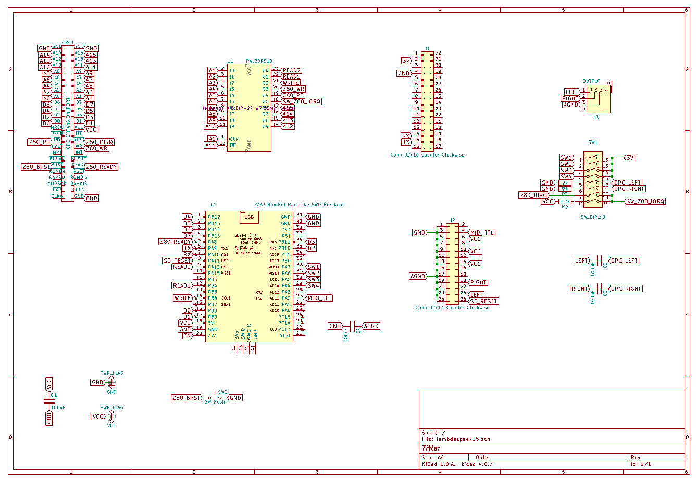 

## Review by the Amstrad Noob 

The Amstrad Noob did a [very nice review of the card](https://youtu.be/bQPLyFjDLsk) - thanks much, Niall, glad you are enjoying it!

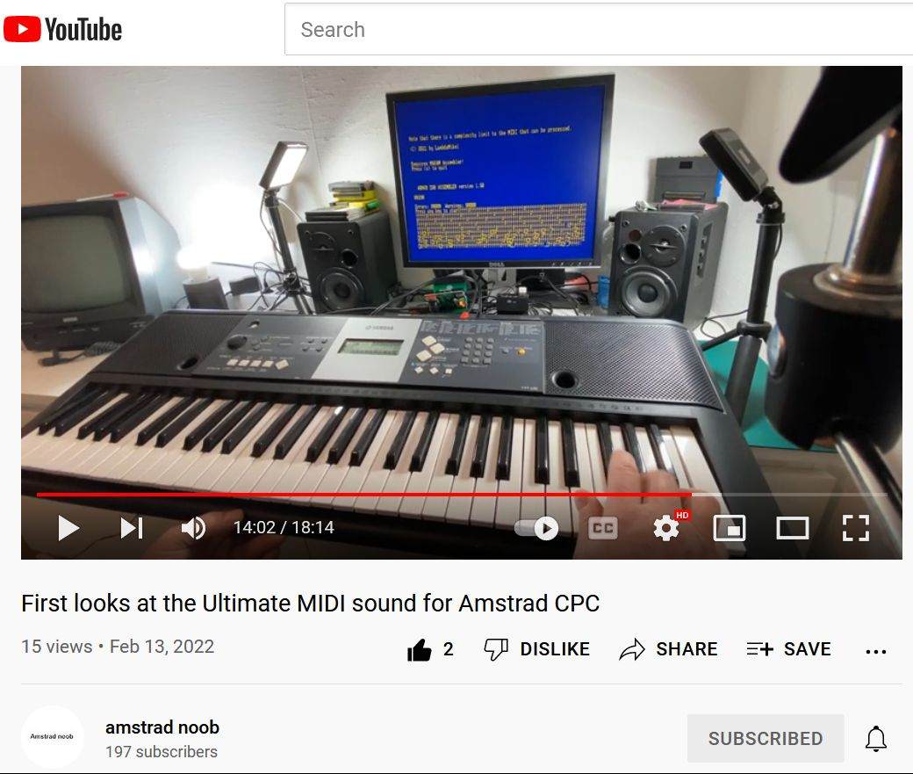 

## YouTube Demos 

["The Turn of a Friendly Card" on the CPC 6128 with the S2](https://youtu.be/L2BTM9haHGY)

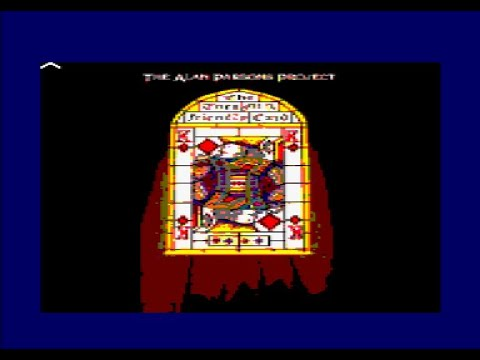 

["Oxygene 4" on the CPC 6128 with the S2 and XMem RAM Expansion](https://youtu.be/ESy15P0HWm8)

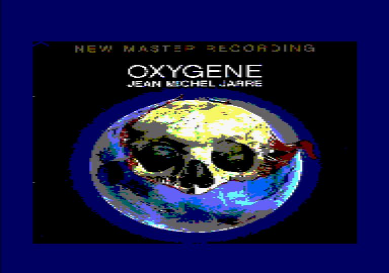 

["Eye in the Sky" on the CPC 464 with the X2GS and XMem RAM Expansion](https://youtu.be/jTj-EcoIfkQ)

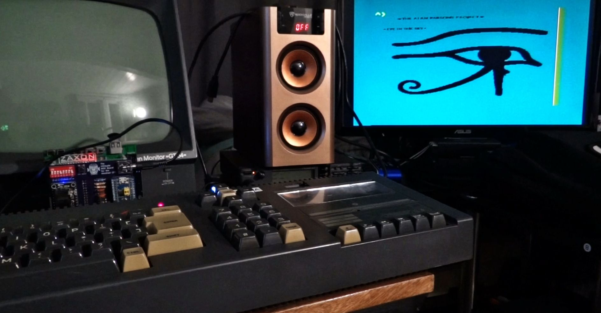 

["Force Majeure" on the CPC 464 with the X2GS and Revaldinho's 512 KB RAM Expansion](https://youtu.be/VNa4OryULDY)

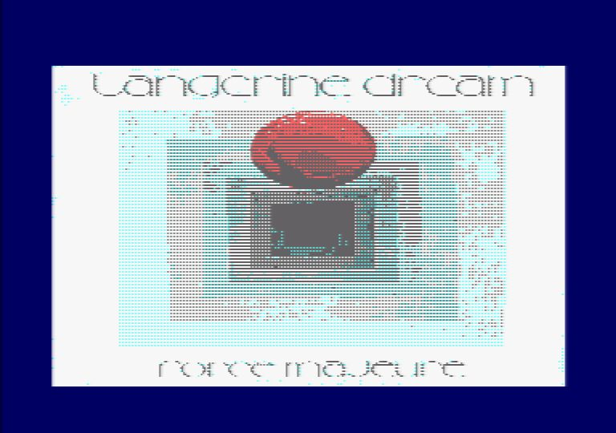 

Some more videos:

[Extended Memory (CPC 6128) and the Ultimate MIDI Card - Untruncated Mammagamma & Axel F](https://youtu.be/RhgFmPhj5Qk)

[New Songs for Ultimate MIDI Card - X2GS GM / GS MIDI Standalone CPC MIDI Playback](https://youtu.be/suhhV89qnpE)

[The fantastic X2GS GM / GS MIDI Soundcard and Standalone CPC MIDI Playback](https://youtu.be/zATfSDlGLWw)

[Standalone CPC MIDI Playback](https://youtu.be/9-n1bf7yXhg)

[Realtime MIDI Transformation performed by the CPC](https://youtu.be/Th2IpnHSq80)

[First PCB Demo](https://youtu.be/ioN5ufExyvQ) 

[DIN MIDI IN to CPC and CPC Synthesizer](https://youtu.be/qN9ypJHENk0)

[DIN MIDI IN to S2 / General Midi MID Playback](https://youtu.be/xLs3ZQm0AvA)

[Sending MIDI Data from the CPC to the S2](https://youtu.be/EcW2L8-IfYQ)

## First Batch Ready!

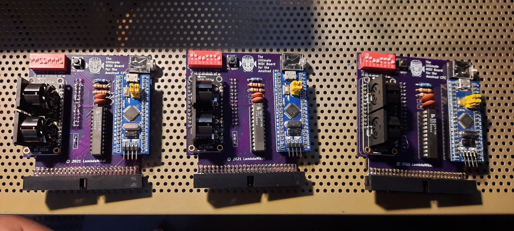 

## Prototype PCB 

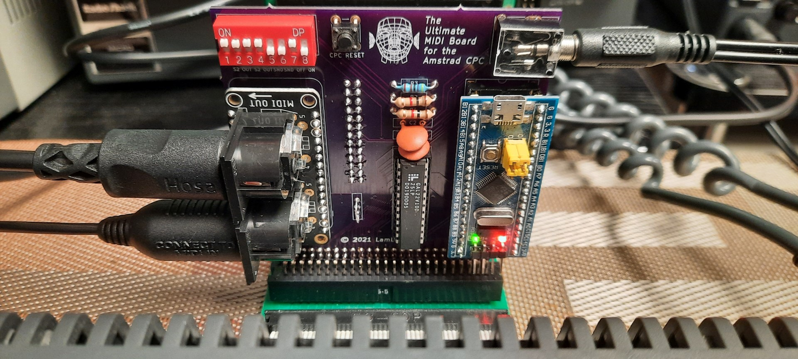 
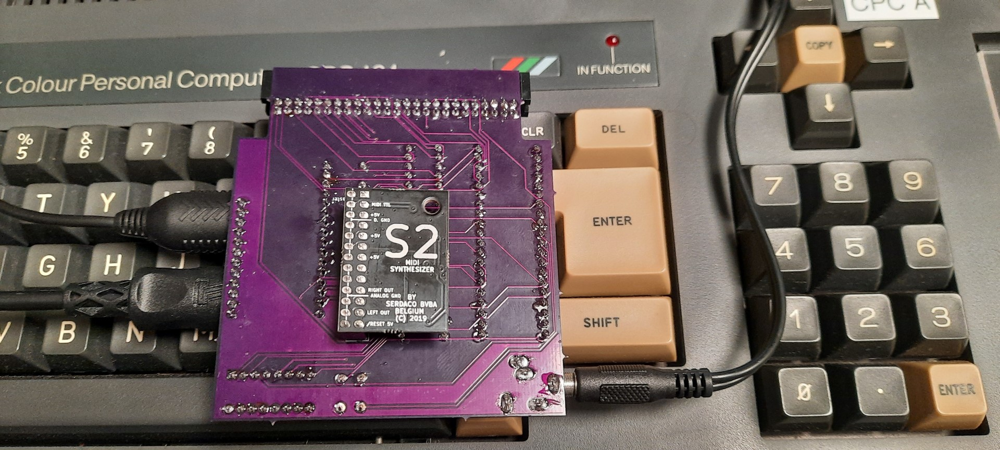 
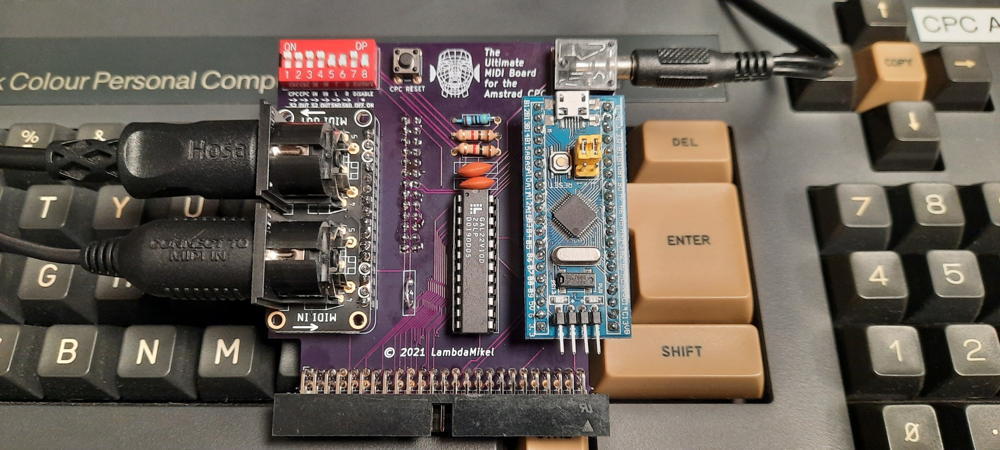 
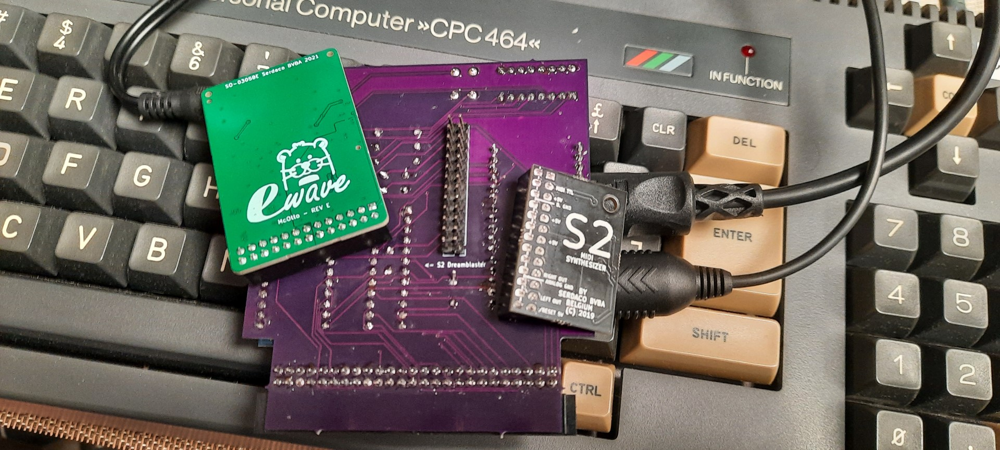 
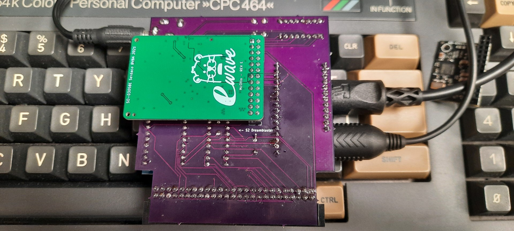 

## Breadboard Pics

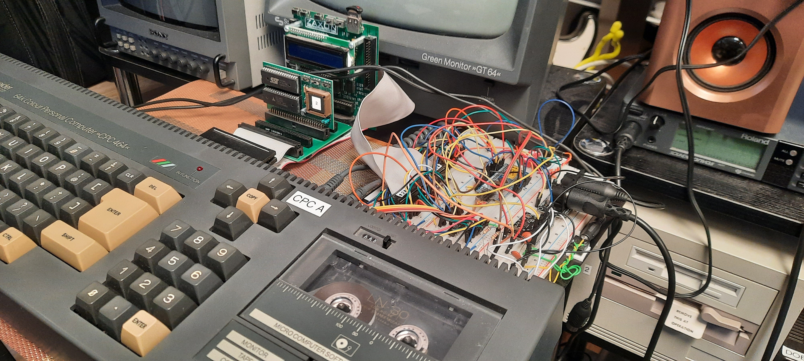 

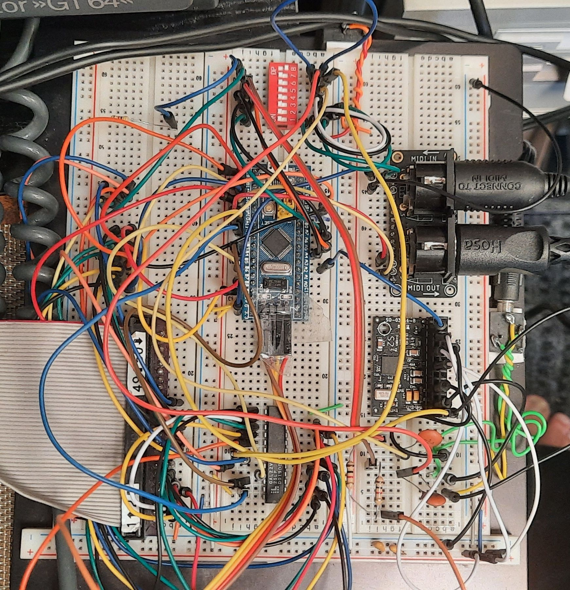 

 

## DIL Switch 

----------------------------------------------
| Switch | Explanation                       | 
|--------|-----------------------------------|
|   1    | Route CPC to S2                   | 
|   2    | Route CPC to MIDI OUT             | 
|   3    | Route MIDI IN to S2               | 
|   4    | Route MIDI IN to MIDI OUT         | 
|   5    | Route S2 L Channel to CPC Speaker | 
|   6    | Route S2 R Channel to CPC Speaker | 
|   7    | 1 = Enable card - make sure 8 = 0 | 
|   8    | 0 = Enable card - make sure 7 = 1 | 
----------------------------------------------

## Software

Read the following description for an explanation of the demo programs. 

## Recommended MIDI Cable

Some PC / MAC MIDI USB cables won't work. I have used this one with
good success:

[DigitalLife USB MIDI Interface Cable](https://www.amazon.com/gp/product/B077X7R74Y).

## First Steps with the Ultimate MIDI Sound Card 

A recent customer asked me for this, so here we go. 

First, load the [`cpc/ULTMIDI.dsk`](cpc/ULTMIDI.dsk) and check out the
programs `MIDIOUT.BAS` and `MIDIDRUM.BAS`, as demonstrated here:
[https://youtu.be/xLs3ZQm0AvA](https://youtu.be/xLs3ZQm0AvA).

That should give you some sound from the stereo socket, and you should
also be able to hear MIDI sound in the CPC speaker if **DIL switches 5
and 6** are set to ON; see above for the DIL switch table.

Note that, for the CPC to S2 MIDI routing to work, **DIL switch 1**
must be set to ON position ("Route CPC to S2").

Next, try to play the MIDI song `SONG2.BIN` from
[`cpc/ULTMIDI3.dsk`](cpc/ULTMIDI3.dsk). Use the `Play` option when the
program starts, and see if you can hear Alan Parsons! See
[https://youtu.be/zATfSDlGLWw](https://youtu.be/zATfSDlGLWw).

There are 8 more such "song fragments" on the
[`cpc/ULTMIDI2.dsk`](cpc/ULTMIDI2.dsk). Read below to learn how you can
record your own song fragments from a MID file being played back by
the PC or Mac.

Please note that that the songs on
[`cpc/ULTMIDI2.dsk`](cpc/ULTMIDI2.dsk) and
[`cpc/ULTMIDI3.dsk`](cpc/ULTMIDI3.dsk) were created using realtime
MIDI recording with the CPC and the Ultimate MIDI Card itself.  The
`RECORDE2.BAS` MAXAM assembler program can be used for that (be sure
to hit `x` to stop the recording; if you record too long, it will
overwrite the CPC's firmware RAM and crash the machine - future work
to make it more robust...) 

However, the songs on [`cpc/PLAYBCK2.dsk`](cpc/PLAYBCK2.dsk),
[`cpc/PLAYBCK3.dsk`](cpc/PLAYBCK3.dsk) and
[`cpc/PLAYBCK4.dsk`](cpc/PLAYBCK4.dsk) were created with a
Python-based `.MID` to `BIN` converter.

The song-fragments on [`cpc/PLAYBCK1.dsk`](cpc/PLAYBCK1.dsk) can be
played with an unextended CPC 464. The `PLAYBACK.BAS` program require
MAXAM assembler. The [`cpc/PLAYBCK2.dsk`](cpc/PLAYBCK2.dsk) contains
complete MIDI songs, but requires a CPC 6128. Songs are now partioned
into 16 KB fragments to support easy loading into the indiviual 16 KB
memory seqments. The `PLAYBACK.BAS` program on this disk requires
MAXAM assembler as well. Finally, ths disks
[`cpc/PLAYBCK3.dsk`](cpc/PLAYBCK3.dsk) and
[`cpc/PLAYBCK4.dsk`](cpc/PLAYBCK4.dsk) require the standard DK'tronics
512 KB memory expansion (or ToTO's XMem, Revaldhino's memory
expansion, etc.) The songs on these disks are rather large and split
into up to 9 16 KB segments. In addition to the `PLAYBACK.BAS` MAXAM
assembler program, there is also a binary version of the loader /
playback program available, `PLAYBIN.BAS`.

See here for [a video of
`cpc/PLAYBCK1.dsk`](https://youtu.be/suhhV89qnpE), and here for [a
video of `cpc/PLAYBCK2.dsk`](https://youtu.be/RhgFmPhj5Qk).

Next, if you have a *MIDI sound module, keyboard or synthesizer*, you
can try connecting it to the *MIDI OUT* socket and see if you can
playback the same sounds / songs with this external device. Note that
you must have **DIL switch 2** set to ON ("Route CPC to MIDI
OUT"). Both switch 1 and 2 can be ON at the same time. In this case,
the CPC-generated MIDI data will be played via the connected external
module, and via the S2 (or X2GS, ... or whatever is plugged in at the
S2 connector at the back of the card).

Next, you can try *MIDI Input*. For that, you will need a *MIDI device
that can generate MIDI data*, e.g., a synth or keyboard, or a MIDI USB
cable and a PC / Mac program that can generate MIDI data. Some come
with a virtual "piano keyboard" that can be used to send MIDI data.
Or you can play back a MID file from the PC that way.

Now, with the external MIDI data generating device connected to MIDI
IN, if **DIL switch 3** is set to ON, then the firmware will
automatically forward any received MIDI message to the S2 (X2GS, ...,
whatever is connected to the S2 plugin header at the back of the
card). *And without CPC involvement.*

So, this allows you to use the card as a *standalone MIDI instrument*.
You only need to supply 5V power via the CPC, but no CPC program is
required. If you can find a way to feed 5 V into the card without the
CPC, then you will have a real standalone GM MIDI expander, like the
Roland Sound Canvas (and it sounds equally good, especially with the
X2GS!).

Next, the card can also act as an additional MIDI Forwarder /
Repeater. This is like the *MIDI THROUGH* socket on MIDI devices. Each
incoming MIDI message is automatically forwarded to the MIDI OUT DIN
socket if **DIL switch 4** is ON. Hence, with switches 3 and 4
enabled, you can play MIDI on the card, and forward the same data at
the same time to another externally connected MIDI device. MIDI
devices can be daisy-chained in that way (and, for example, be
configured for different MIDI channels).

Now, if you want to *process the MIDI data received over the MIDI IN
socket with the CPC,* then you want to *disable switch 3*, because
else every incoming MIDI message would be played back automatically by
the card (the plugged-in S2, X2GS, ...), BluePill firmware-based.

So the next test then is to *disable switch 3*, connect your MIDI
synth / keyboard or PC USB MIDI cable to MIDI IN as before, and now
load the program `CPCSYNTH.BAS` from the
[`cpc/ULTMIDI.dsk`](cpc/ULTMIDI.dsk). You will need the **MAXAM 1.4
assembler** in ROM. As soon as the program starts ("press any key"), you
should see incoming MIDI sync messages on the screen from the external
MIDI device (or MIDI USB PC cable). 

Any incoming MIDI Note On / Off message will be played in the CPC
speaker; i.e., the CPC's internal AY-3-8912 soundchip now acts as a
MIDI instrument. It is 3note polyphonic. **Note that it listens to
MIDI channel 0 (or 1?), so the MIDI channel needs to be set correctly
on the external instrument / MIDI device!** generating the Note On /
Note Off messages.

Whereas `CPCSYNTH.BAS` demonstrates how to turn the CPC into a simple
3note polyphonic MIDI keyboard using MIDI IN, the `CPCTHRU.BAS`
program on the [`cpc/ULTMIDI.dsk`](cpc/ULTMIDI.dsk) demonstrates how to
receive MIDI data and simply forward it with a CPC program. Again,
MAXAM assembler in ROM is required. So, with this program running, any
incoming MIDI message will be forwarded / echoed / relayed to MIDI
OUT. This achieves the same effect as described above, but this time
the "forwarding function" is computed by the CPC rather than the
BluePill firmware.

This gives of course more flexibility, because now we can change the
MIDI data stream *on the fly* with a CPC program. This is demonstrated
with the `CPCTRAFO.BAS` MAXAM assembler program. Here, MIDI data can
be transposed by 0, 1, 2 octaves on the fly. See
[https://youtu.be/Th2IpnHSq80](https://youtu.be/Th2IpnHSq80).

**Watchout for the following gotcha: if you have MIDI IN & MIDI OUT connected
to the PC / Mac program that you are using to send data, make sure that
you don't have a MIDI IN -> MIDI OUT Soft Thru enabled in the PC / Mac program!
Because that'll result in an infinite MIDI feedback loop if you also have
Switch 4 enabled on the card (Route MIDI IN -> MIDI OUT). The CPC
will crash for sure trying to process that stream!** 

Finally, you can try to record a whole complex stream of MIDI
messages, generated by playing back a a complex `.MID` GM MIDI song,
"in realtime" into CPC memory. Once in CPC memory, you can play it
back from there, and also save it to disk. This is what the program
`RECORDER2.BAS` on [`cpc/ULTMIDI3.dsk`](cpc/ULTMIDI3.dsk) is doing
(MAXAM assembler again).  All the song fragments on
[`cpc/ULTMIDI2.dsk`](cpc/ULTMIDI2.dsk) and
[`cpc/ULTMIDI3.dsk`](cpc/ULTMIDI3.dsk) were created that way - I
simply played back a complex GM `.MID` song with the PC using a MID
file player. 

However, the data format is not optimized yet, and the program is
proof-of-concept and "bare bones" only. So depending on the complexity
of the MIDI data that is being recorded in that way, you'll reach the
end of the CPC memory after about 45 seconds to 1 minute, and then the
program crashes when firmware locations are overwritten in RAM by the
`RECORDER2.BAS`. I should find some time to improve the program at
some point. So, when recording, make sure to hit the "x" key to quit
"early enough" during recording, else it crashes your CPC.  There is a
video of the recording process:
[https://youtu.be/9-n1bf7yXhg?t=780](https://youtu.be/9-n1bf7yXhg?t=780)

**And a note of warning:** depending on the complexity of the MIDI
recorded that way, this is really at the limit of what the BluePill &
CPC combo can do. **If the MIDI gets too complex, then the CPC might
also crash.** This is caused by the BluePill. The CPC software
generates `IOREAD / IOWRITE` requests on the Z80 bus, for reading and
writing of MIDI data. The BluePill firmware handles these IO requests
purely in software, using Interupt Request Handlers (ISRs). CPC IO
requests hence cause interupts to the BluePill firmware program. At
the same time, MIDI data also generates interupts. If there are too
many interupts being generated from highly complex incoming MIDI data,
then the BluePill might not have enough processing speed to also serve
the CPC-generated interupts in a timely fashion concurrently, hence
violating the Z80 IO port protocol, crashing the system.

The songs on [`cpc/ULTMIDI2.dsk`](cpc/ULTMIDI2.dsk) and
[`cpc/ULTMIDI3.dsk`](cpc/ULTMIDI3.dsk) are at the absolut limit of what
can be recorded in REALTIME with the CPC & BluePill combo, and I had
to record them with the CPC 464, as my 6128 was having timing issues
here. It is possible that I will try to tweak the firmware a bit more
at some point, but not much can be done to eleviate this problem, as
the bandwidth / speed is simply not there in the BluePill (one would
think 72 MHz are enough, but... it is at the limit). So, when trying
to record this on your own, your "milage may vary". 

Note that this problem only occurs for ultra-complex polyphonic
mult-track MIDI data realtime recording / streaming (i.e., a whole
complex MIDI song is being recorded in realtime, not only a single
MIDI instrument track as one would usually do in a standard MIDI
sequencer application), and that the problem only occurs for
recording, not for playback. Also, less complex MID songs are entirely
unproblematic, i.e., recording classical music that usually consists
of piano track only etc. does not cause any bandwidth issues.

At some point, I also want to write a MID file player for the CPC
(other customers are also working on this). Then there would be no
need to "record" the MIDI songs in that way. 

## Python Converter

Use the [`PythonConverter/`](PythonConverter/) executable to convert
MIDI files into BIN files for the CPC `playback.bas` (MAXAM) or
`blackback.bin` machine code program.  You'll find these programs on
the demo disks; e.g., [`cpc/FORCE.dsk`](cpc/FORCE.dsk). 

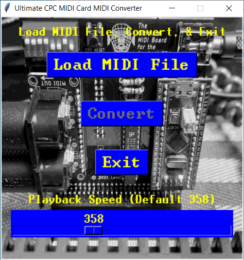 

## Latest News

- 3/1/2022: the Python converter is available now.

 

- 1/26/2022: first steps with the Python-based MID->BIN converter to
create complex MIDI content for the card.  Support of the CPC 6128
extended memory and DK'tronics "standard" 512 KB memory expansion.

- 9/15/2021: 3 more devices have been sold, and a "Howto - First
  Steps" section was added to this README.

- 7/1/2021: MIDI Data Stream Recorder implemented - I can now record &
  play back complex GM MIDI songs from the CPC memory. As usual, the
  Z80 assembler source code of the [MIDI recorder & playback program
  and a number of BIN song files are in the repo](cpc/ULTMIDI2.dsk). A
  demo of the program and the 8 song `BIN`s is on YouTube: [Standalone
  CPC MIDI Playback](https://youtu.be/9-n1bf7yXhg). I expect this kind
  of "MIDI data playback from CPC memory" to be the main application
  for the card, so most people will just use it as a MIDI sound card
  for their CPCs. However, unlike other MIDI sound cards, you can
  effortlessly create MIDI songs simply by recording the MIDI stream;
  hence, content / song creation for the card is literally effortless
  if you have a PC USB MIDI cable.

The friends from
[Matrixsynth](https://www.matrixsynth.com/2021/07/the-ultimate-cpc-midi-soundcard.html)
also posted my update - thanks, guys!

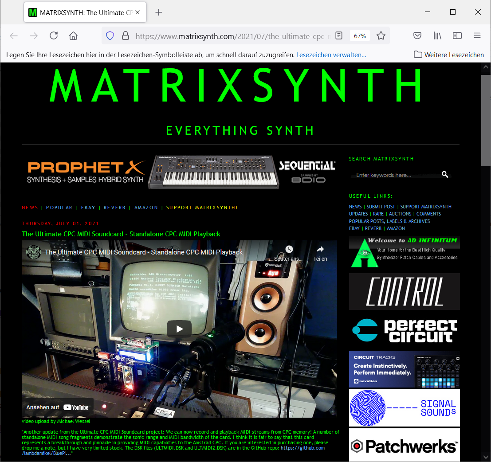 

 
- 6/23/2021: First batch produced and sold! 

 

- 6/19/2021: The Prototype PCBs are working! 

 

- 6/11/2021: The Prototype PCBs have been designed and are currently in production. 

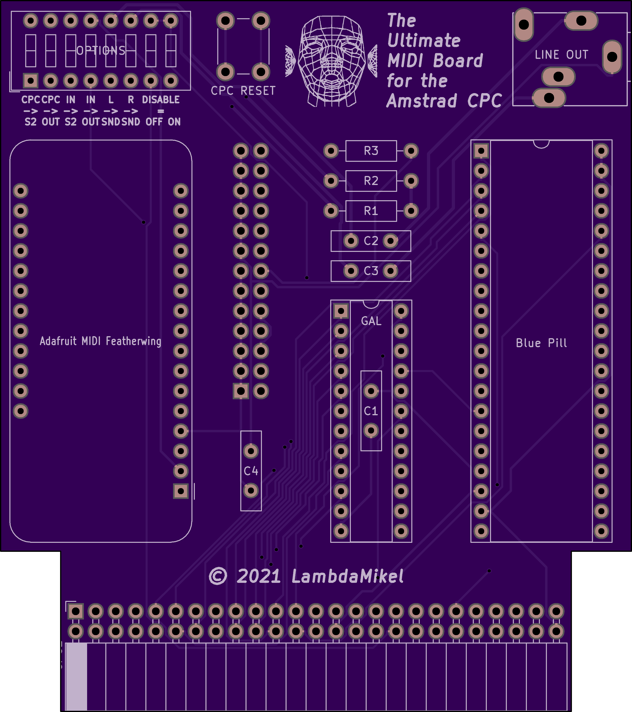 
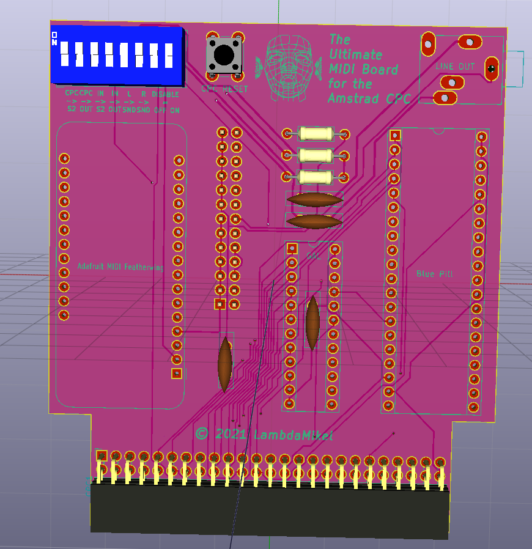 

- 6/1/2021: The project was featured by Matrixsynth. 

 

 

 

## About

Soon! 

