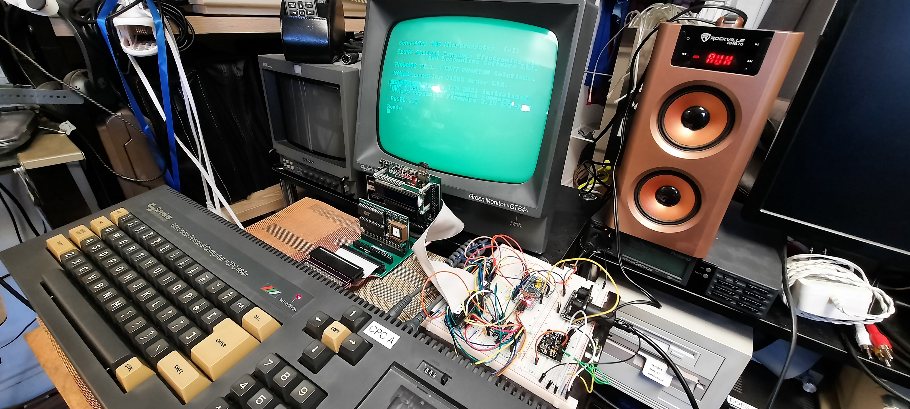

# BluePillCPC
An Extension Board for the Amstrad CPC based on the Blue Pill Microcontroller 

It's a generic IO interface to the CPC, so use cases are generic. 

## The Ultimate CPC MIDI Sound & MIDI Interface Card

The first application of this IO interface: using an S2 Waveblaster from
Serdashop and an Adafruit Midifeather board to create the ultimate
CPC MIDI sound + MIDI interface card. 

Features:

- CPC MIDI Soundcard using the S2 GM MIDI Module from Serdashop
- CPC can send MIDI date over output port `&FBEE` to the S2
- MIDI DIN IN and OUT via Adadfruit Midifeather 
- MIDI IN to the CPC: check for new MIDI byte on input port `&FBFE` and fetch pending byte from buffer via `&FBEE`
- MIDI soft through: all incoming MIDI data (from CPC or MIDI IN) can be forwarded / relayed to the MIDI OUT socket ("MIDI SOFT THRU")
- CPC MIDI Synthesizer software in machine code (MIDI INPUT demo) 
- CPC GM Drumcomputer software in BASIC (MIDI OUTPUT demo) 
- "Lazy engineering": MX4 compatible CPC extension board using three
sockets, one for the Blue Pill, one for the S2, one for the optional Midifeather.
- Only one additional chip required - a GAL22V10 programmed as an address decoder. The Blue Bill does not have enough 5V-compatible GPIO ports to do the
decoding fully in sofware
- Everything else is done purely in software - unlike LampdaSpeak, no additional glue logic is required to manage the databus (e.g., no flip flop to latch 
the databus upon IOWRITE requests, or busdriver to tristate the microcontroller output to the bus upon IOREAD requests). The 72 MHz Blue Pill is fast enough to respond to and manage IO requests and the databus via ISRs (Interupt Service Routines). It was tedious to get the timing of the ISRs right (done by inserting ``__asm__("nop")`` at the right spots), but it works flawlessly by now.
- no extra circuitry for Z80 /WAIT managment 
- Low costs - final PCB will be in the 50 to 60 ¤ range 
- Very DIY friendly (no SMD, plug and play of standard modules)

Some YouTube videos: 

[DIN MIDI IN to CPC and CPC Synthesizer](https://youtu.be/qN9ypJHENk0)

[DIN MIDI IN to S2 / General Midi MID Playback](https://youtu.be/xLs3ZQm0AvA)

[Sending MIDI Data from the CPC to the S2](https://youtu.be/EcW2L8-IfYQ)

 

 

 

## Latest News

- 6/1/2021: The project was featured by Matrixsynth. 

 

 

 

## About

Soon! 

