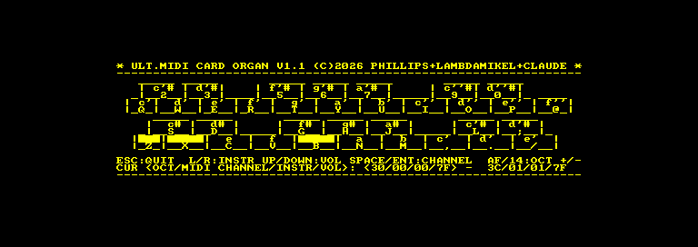

# MIDORG - a MIDI Organ for the Ultimate MIDI Card

Play the CPC keyboard as a two manual MIDI organ. Keys light up as you
press them.

Ported from George Phillips' MIDORG for
[MIDI/80](https://github.com/lambdamikel/MIDI-80), the TRS-80 card this
one grew out of. The port to the CPC was done by
[Claude](https://claude.com/claude-code) (Anthropic).

    RUN"MIDORG

It is on all three TRACKER discs, in `dsk/` and `hfe/`.

## Playing it

Two manuals, each on its own MIDI channel, laid out like an organ:

    upper   2 3   5 6 7   9 0        black keys
            Q W E R T Y U I O P @    white keys, c' to f''

    lower   S D   G H J   L ;        black keys
            Z X C V B N M , . /      white keys, c to e'

The lower manual is the bottom two rows of the keyboard, the upper manual
the top two - so both hands fall naturally where they would on a real
two manual instrument. Hold as many keys as you like; every note is
tracked independently and the box on screen fills in solid while it
sounds.

| | |
|---|---|
| `A` `F` | lower manual octave down / up |
| `1` `4` | upper manual octave down / up |
| SPACE | switch which manual the controls below affect |
| RETURN / SHIFT | MIDI channel up / down for the selected manual |
| left / right arrow | GM instrument down / up |
| up / down arrow | volume up / down |
| ESC | quit (resets the machine) |

The status line shows `OCT/CHANNEL/INSTRUMENT/VOLUME` for both manuals in
hex, with `<...>` marking the one SPACE has selected.

Instrument and volume are per MIDI channel, so you can set up a different
sound on each channel and switch between them with RETURN.

## How the port works

`midorg.asm` is generated, not forked - `mkmidorg.py` applies the same
zmac-to-rasm pass and named region replacements that `mktracker.py` does.
Only four things are actually machine specific:

**The keyboard.** The TRS-80's matrix is memory mapped, so a key test is
just `ld a,($3801)`. The CPC's sits behind the PSG, so the whole matrix is
scanned into `kbdmap` once per pass and the key macros read that instead.
A CPC key reads **0** when pressed - the opposite of a TRS-80 - so the
copy is complemented into `kbdmapi`, after which every one of the
original's tests is correct exactly as written.

**MIDI**, **the display** (TRACKER's layer, with the shadow buffer at
`#3C00` so every screen address ports untouched), and **the exit path**
(BREAK becomes ESC; there is no DOS to return to, so it resets).

### The part that is George's, and why it ported for free

Each key test ends in `call nz,key_down`. The handler pops the return
address, **rewrites those three bytes in place** to `call z,key_up`, and
jumps back. So the very instruction that started the note becomes the one
watching for its release, and there is no key-state table anywhere. It is
a lovely piece of code and it crossed over without a change, because the
CPC macro keeps `call nz,handler` as its last three bytes - that offset,
`(iy-3)`, is load bearing.

### Highlighting

Every key box in the artwork carries a `*`. At startup `scanmarkers` walks
the art, records where each marker sits and how wide its box is, then
blanks it. Pressing a key fills the box with solid blocks; releasing it
copies the original text back from the title image still in RAM.

On the CPC the block is character `#8F` - checked against the ROM font, it
is the only glyph whose eight scanlines are all `#FF`. Both `keyhilite`
and `keyrestore` push their own pixels, because MIDORG has no main loop
running an incremental screen scan, and a key that lights up 26 ms after
you press it is not an organ.

## Two rasm traps this port turned up

Both produced code that assembles cleanly and then misbehaves, which is
the worst kind.

**`/` rounds, it does not truncate.** `#0880 / 256` assembles as **9**,
not 8. zmac's `high(x)` must therefore become `x >> 8`, never `x / 256` -
otherwise every self-modified jump target with a low byte >= `#80` gets a
high byte one too large, and the key handlers rewrite themselves to jump
into the middle of other routines.

**A leading `(` is memory addressing.** `ld (iy-1),(label >> 8)` is read
as an indirect load, not an immediate. Write `ld (iy-1),label >> 8`.

## Verified

Under MAME, driving the key matrix directly:

| | |
|---|---|
| lower C (`Z`) | `90 30 7F` on, `80 30 7F` off, box lit and restored |
| upper c' (`Q`) | `91 48 7F` - second manual, second channel, right octave |
| lower C# (`S`) | `90 31 7F`, and the wider black-key box lights |
| `Z`+`B` together | both notes on, both off - polyphony holds |
| octave, instrument, volume, channel | all step correctly, and program changes go out on both channels |
| `ESC` | resets to a clean BASIC `Ready` |

Not yet played on real hardware.
