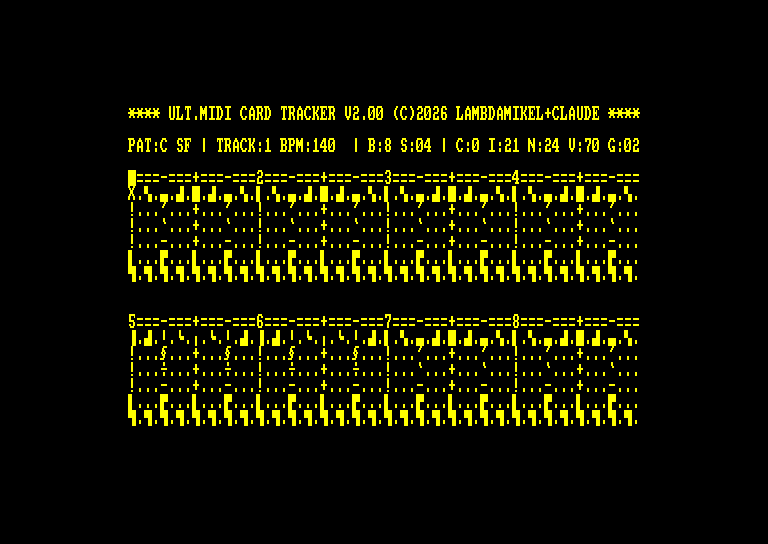
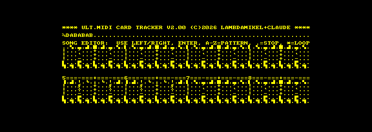
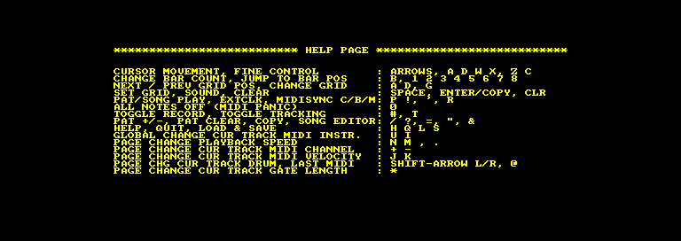

# TRACKER for the Ultimate MIDI Card

A six track MIDI step sequencer for the CPC 6128, driving the Ultimate
MIDI Card.

Ported from **TRACKER 2.00** for the
[MIDI/80](https://github.com/lambdamikel/MIDI-80), my MIDI sound and
interface card for the TRS-80 - which is itself the card the Ultimate MIDI
Card grew out of, so this brings the software back the other way. The
original, its Z80 source and its
[demo songs](https://github.com/lambdamikel/MIDI-80/tree/main/songs) are
in that repository.

**The port to the CPC was done by [Claude](https://claude.com/claude-code)
(Anthropic)** - the display layer, the PSG keyboard scan, the AMSDOS file
I/O, the timing model, and the generator that produces the CPC source from
the TRS-80 original.

There is also **[MIDORG](MIDORG.md)**, a two manual MIDI organ that plays
the CPC keyboard, on the same discs.

## Just run it

`dsk/` and `hfe/` each hold three ready to run discs, one per demo song.
Put one in the drive and type

    RUN"TRACKER

then `L` and `Y` to load the song, and `P` to play it. `!` plays the whole
arrangement instead of the one pattern. `H` is the help page.

| song | | |
|---|---|---|
| 12 bar blues shuffle, 140 BPM | `dsk/tracker-boogie.dsk` | `hfe/tracker-boogie.hfe` |
| Berlin school 16th note sequence, 120 BPM | `dsk/tracker-sequence.dsk` | `hfe/tracker-sequence.hfe` |
| six voice drum machine, 125 BPM | `dsk/tracker-drums.dsk` | `hfe/tracker-drums.hfe` |
| Berlin school, Tangerine Dream style, D minor, 116 BPM | `dsk/tracker-aurora.dsk` | `hfe/tracker-aurora.hfe` |

`Q` quits by resetting the machine - TRACKER loads over BASIC's program
area, so there is nothing left to return to.

## Using it

### What you are looking at

    **** ULT.MIDI CARD TRACKER V2.00 (C)2026 LAMBDAMIKEL+CLAUDE ****
    PAT:C SF | TRACK:1 BPM:140  | B:8 S:04 | C:0 I:21 N:24 V:70 G:02
    1===-===+===-===2===-===+===-===3===-===+===-===4===-===+===-===
    <track 1, bars 1-4>
    <track 2, bars 1-4>            six rows, one per track
    ...
    5===-===+===-===6===-===+===-===7===-===+===-===8===-===+===-===
    <track 1, bars 5-8>
    ...                            the same six tracks, bars 5-8

Each grid row is one track, and each column is a 16th note. Eight bars of
16ths is 128 steps, which is why the pattern is split into two blocks of
64: bars 1-4 on top, bars 5-8 below. The ruler rows number the bars and
mark the beats, and the play cursor runs along them while the song plays.

The status line, left to right:

| | |
|---|---|
| `PAT:C` | the pattern being edited, A to Z |
| `S` | transport - `H` stopped, `P` playing a pattern, `S` playing the song |
| `F` | cursor tracking - `F` free, `T` follows the play cursor |
| (blank) | record - blank for playback, `*` when armed |
| `\|` | external clock - `\|` off, `'` on |
| (blank) | MIDI sync out - blank off, `C` clock, `B` clock+MMC, `M` MMC only |
| `TRACK:1` | which track the cursor is on |
| `BPM:140` | the real tempo, computed from the step period |
| `B:8` | bars in this pattern, 1 to 8 |
| `S:04` | grid resolution - the cursor and note entry snap to this |
| `C:0` | MIDI channel for this track |
| `I:21` | GM instrument, hex - **global**, not per pattern |
| `N:24` | note used when you press SPACE, hex. For a drum track this is the drum |
| `V:70` | velocity, hex |
| `G:02` | gate length in steps - how long the note is held |

The channel, instrument, drum note, velocity and gate are all *per track*,
and change with wherever the cursor is.

### A first pattern

1. `L` then `Y` loads the `DUMP` on the disc, or start from the empty
   pattern the program boots with.
2. Move the cursor with the **arrow keys**. `A` and `D` jump by the grid
   resolution, `Z` and `C` step one column at a time, `W` and `X` change
   track. `1`-`8` jump straight to a bar.
3. **SPACE** puts a note in the step under the cursor, using the `N:` note
   for that track. **ENTER** or **COPY** does the same *and* sounds it, so
   you can hear what you are placing. **CLR** removes it.
4. `+` `-` set the MIDI channel for the track, `U` `I` the instrument,
   `J` `K` the velocity, `*` the gate length. SHIFT with the left and
   right arrows sets the drum note - use channel 10 and a track becomes a
   drum voice.
5. `P` plays the pattern in a loop. `P` again stops, and silences anything
   still sounding.
6. `,` `.` nudge the tempo, `N` `M` move it in bigger jumps. `B` sets how
   many bars the pattern is, `G` the grid resolution.
7. `S` then `Y` saves everything to the disc as `DUMP`.

`0` is the panic button - all notes off on all 16 channels - if anything
ever hangs.

### Recording from a keyboard

Plug a MIDI keyboard into the card's MIDI IN, press `#` to arm record and
`T` so the cursor follows the playback, then `P`. Notes you play land in
the grid, quantised to the current grid resolution. Only channel 1 note-ons
are recorded. `@` sets the track's drum note to the last note received,
which is a quick way to pick a drum sound by playing it.

**Record with a decaying sound, not an organ.** TRACKER reads note-ons
from MIDI IN and ignores note-offs entirely - a note's length comes from
the track's Gate Time, not from how long you held the key. While you
record, what you play is echoed to MIDI OUT so you can hear it, but the
note-off for a note is only sent when the *next* note arrives. The note
you played last therefore keeps sounding until you play another one. With
a piano, a guitar or anything else that decays by itself you will never
notice; with an organ, strings or a pad it drones. Record with a decaying
sound and set the instrument back afterwards.

Playback is unaffected: there TRACKER generates the note-offs itself from
the Gate Time setting, so nothing hangs.

**Set your keyboard to send real note-offs.** Some keyboards send note-on
with velocity 0 instead of a note-off. TRACKER has no special case for
that, so it records the key *release* as a second note - every note you
play lands twice. A keyboard that sends proper `&80` note-offs is filtered
correctly and records cleanly.

### Chaining patterns into a song

`/` and `?` step through the 26 patterns, `"` copies one to another, `=`
clears one. `&` opens the song editor: a row of pattern letters, one per
position. Move with the left and right arrows, type a letter A-Z to place
a pattern, `.` to stop there, `*` to loop back to the start. ENTER leaves
the editor. `!` then plays the whole arrangement instead of a single
pattern.

The song row sits where the status line normally is, with the current
position marked:

While a *pattern* is playing, `1`-`8` queue patterns A-G to switch in at
the end of the current bar - handy for playing an arrangement by hand.
(Key `4` repeats pattern C rather than giving D; that is a slip inherited
from the TRS-80 original.)

### Syncing to other gear

`R` cycles the MIDI clock output: off, `C` clock plus start/stop, `B` clock
plus MMC transport, `M` MMC only. In any of the clock modes the CPC sends
24 ppqn and everything downstream follows its tempo.

`'` goes the other way - TRACKER then steps on incoming MIDI clock, six
`&F8` bytes to a 16th note, so a drum machine or a DAW can drive the CPC.

A step pulse also appears on the Centronics data lines at `&EF00` for
anything that wants a hardware clock.

**Future feature: external clock on the printer port.** The TRS-80 version
takes its external step pulse off the printer port rather than over MIDI,
and the CPC could do the same. The seven Centronics *data* lines are
output only, but the **BUSY line is an input and it is readable** - PPI
port B, `&F5xx`, bit 6, Centronics pin 11. Measured on an emulated 6128
over 2000 samples, port B reads `1E` with only bit 0 (VSYNC) changing:

| bit | | |
|---|---|---|
| 0 | CRTC VSYNC | toggles |
| 1-3 | manufacturer | `111`, Amstrad |
| 4 | refresh rate | `1`, 50 Hz |
| 5 | cassette in | 0 |
| **6** | **printer BUSY** | **readable - Centronics pin 11** |
| 7 | expansion `/EXP` | 0 |

So the hardware is there; it is simply not wired up in the software yet.
That would let one clock box drive both machines.

### The help page

`H` shows all of it, and any key returns:

## Keys at a glance

| | |
|---|---|
| arrow keys, `Z` `C` | move the cursor a step at a time |
| `A` `D` | move by the grid resolution |
| `W` `X` | previous / next track |
| `1`-`8` | jump to bar - or, while playing, queue that pattern |
| SPACE | place a note |
| ENTER, COPY | place a note and sound it |
| CLR / DEL | clear the step |
| `P` / `!` | play pattern / play song |
| `0` | all notes off (panic) |
| `/` `?` | next / previous pattern |
| `=` `"` `&` | clear pattern, copy pattern, song editor |
| `+` `-` | MIDI channel for this track |
| `U` `I` | GM instrument (global) |
| `J` `K` | velocity |
| SHIFT + left/right arrow | drum note |
| `@` | drum note from the last MIDI note received |
| `*` | gate length |
| `,` `.` `N` `M` | tempo |
| `B` `G` | bar count, grid resolution |
| `#` `T` | record, cursor tracking |
| `R` `'` | MIDI clock out, external clock in |
| `H` `L` `S` `Q` | help, load, save, quit |

The arrow keys and `COPY` are CPC additions; everything else is as it is
on the TRS-80.

## Building

Needs [rasm](https://github.com/EdouardBERGE/rasm) and
[iDSK](https://github.com/cpcsdk/idsk):

    cd src
    python3 mktracker.py          # tracker7.asm -> tracker.asm
    rasm tracker.asm              # -> TRACKER.BIN, with an AMSDOS header
    python3 mkmidorg.py           # and the same for the organ
    rasm midorg.asm               # -> MIDORG.BIN

then put it on a disc together with a song:

    iDSK out.dsk -n
    iDSK out.dsk -i TRACKER.BIN -t 2 -f
    iDSK out.dsk -i DUMP -t 1 -c 4000 -e 4000 -f

`-t 2` matters: `TRACKER.BIN` already carries its own AMSDOS header, so it
must go in raw. For an HFE, `hxcfe -finput:out.dsk -foutput:out.hfe
-conv:HXC_HFE`.

`tracker.asm` is checked in, so `rasm tracker.asm` alone is enough if you
do not want to run the generator.

## How the port works

**`tracker.asm` is generated, not forked.** `mktracker.py` takes the
TRS-80 source (`tracker7.asm`, also here) and applies a mechanical
zmac-to-rasm syntax pass plus a set of named region replacements, one per
thing that is genuinely machine specific. About 600 of the 4000 lines are
new; the editor, the song mode, the note scheduler and the MIDI clock
generator are the TRS-80's own code, running unchanged. Re-running the
script pulls fixes across from the original.

**The trick the whole thing rests on:** TRACKER writes characters straight
into TRS-80 video RAM, computing addresses like `#3C00 + 14*64 + 35`. So
the port puts a 64x16 shadow buffer *at #3C00*, the TRS-80's own video
address, and points that code at it. Every address calculation is then
correct as written, and a renderer turns the buffer into mode 2 pixels.
Not one screen address had to change.

The 64x16 grid is spread over 20 of the CPC's 25 rows rather than packed
into 16. Packed it fills 80% of the width but only 64% of the height and
reads as stretched, because a CPC character cell is 8x8 where a TRS-80's
is 8x12.

**Timing.** The TRS-80 has to *estimate* elapsed time - video wait states,
DRAM refresh and a variable ROM keyboard call all move under it - and that
estimate is what made its BPM readout read low. The CPC needs none of it:
the gate array stretches every instruction to a whole number of
microseconds, so with interrupts off each region of the loop costs exactly
what it costs. The step period is computed, not calibrated:

    steptarget = 7741 + 191 * tempo      in 4 us units
    BPM        = 3750000 / steptarget

which matches the TRS-80's measured `30963 + 763*tempo` us to within 0.1%,
so a song plays at the speed it does on the machine it came from. Measured
over 420 steps with the step boundary tapped directly: **107453 us against
a 107364 target, +0.08%, jitter sd 244 us**.

**MIDI byte pacing.** MIDI is 31250 baud, so a byte occupies the wire for
320 us and nothing can go out faster, whatever the card's buffer does. The
wait lives inside `midiout` rather than at the call sites, so the clock
bytes and the panic messages - which are bare `OUT`s - get it too. This
matters more than it sounds: an earlier version paced at 98 us, and on
real hardware whole chords and program changes went missing, because a
step where five tracks sound is 15 bytes that need 4.8 ms.

**Files**

| | |
|---|---|
| `src/mktracker.py`, `src/zmac2rasm.py` | the port itself; they generate `tracker.asm` |
| `src/tracker7.asm` | the TRS-80 original it is generated from |
| `src/tracker.asm` | generated - do not edit |
| `src/render.asm` | the display layer and the two row maps |
| `src/kbdcpc.asm` | the PSG keyboard scan and the key tables |
| `src/midi.asm` | MIDI send/receive, including the byte pacing |
| `src/fileio.asm` | AMSDOS save/load |
| `src/font.asm` | generated from `OS_6128.ROM` at &3900 |
| `src/mkmidorg.py`, `src/midorg7.asm` | the same, for [MIDORG](MIDORG.md) |
| `PORTING-NOTES.md` | the full engineering log: what was measured, what broke, and why each layer is the way it is |

## Notes for anyone doing something similar

- **`RUN"` leaves the CASSETTE jumpblock in place.** At the BASIC prompt
  `&BC77` reads `DF 8B A8` (disc); inside a running binary it reads
  `CF E5 A4` (tape). A machine code program that wants disc must restore
  the 13 disc vectors itself - one LDIR of 13x3 bytes of `DF 8B A8`. And
  because AMSDOS identifies which call was made from the stacked return
  address plus `&10D2`, that pattern may only live in genuine jumpblock
  slots.
- **Do not use `TXT GET MATRIX` (&BBA5) for the font.** It returns a
  lower-ROM address that is paged out once the call returns, so it reads
  RAM and yields zeros. Extract from the OS ROM at `&3900` instead.
- **`SCR SET MODE` resets the palette**, so the mode and the inks have to
  be set together every time the screen is re-established.
- `&FBEE` sits close to the floppy controller at `&FB7E/&FB7F`, which is
  only partially decoded and shares A10=0. No trouble seen, but worth
  knowing.

## Status

**Confirmed working on real hardware** - a CPC 6128 with the Ultimate MIDI
Card. Load, playback, the editor, song mode, MIDI clock out and external
sync all work, and so does [MIDORG](MIDORG.md).

Saving with `S` writes the correct bytes to the floppy controller but has
had less testing than the rest.

Songs interchange with the TRS-80 version: the data segment is byte for
byte the same, so a `DUMP` written on one machine loads on the other.
